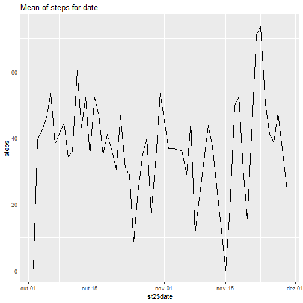

&nbsp;

##1)IMPORT DATA SET 


```r
library(readr)
activity = read_csv("activity.csv"
,col_types = cols(date = col_date(format = "%Y-%m-%d"))))
```
&nbsp;


#####Show data set 


```r
head(activity)
```

```
##   steps       date interval
## 1    NA 2012-10-01        0
## 2    NA 2012-10-01        5
## 3    NA 2012-10-01       10
## 4    NA 2012-10-01       15
## 5    NA 2012-10-01       20
## 6    NA 2012-10-01       25
```


&nbsp;


#####Make a new data set whith a new variable that sum all steps, for each day


```r
library(dplyr)
  st <- activity %>%
    filter(!is.na(steps)) %>%
    group_by(date) %>%
    summarize(st_soma = sum(steps)) %>%
    print
```

```
## # A tibble: 53 x 2
##    date       st_soma
##    <date>       <int>
##  1 2012-10-02     126
##  2 2012-10-03   11352
##  3 2012-10-04   12116
##  4 2012-10-05   13294
##  5 2012-10-06   15420
##  6 2012-10-07   11015
##  7 2012-10-09   12811
##  8 2012-10-10    9900
##  9 2012-10-11   10304
## 10 2012-10-12   17382
## # ... with 43 more rows
```

&nbsp;

#####2)Histogram of the total number of steps taken each day 


```r
library(ggplot2)
qplot(st$st_soma,geom = 'histogram',main = "Histogram for Steps", ylab = "steps")
```


&nbsp;


#####3)Mean and median number of steps taken each day


```r
mean(st$st_soma)
```

```
## [1] 10766.19
```

```r
median(st$st_soma)
```

```
## [1] 10765
```
&nbsp;


#####4)Time series plot of the average number of steps taken

*  Calculation of the mean, for each day

```r
st2 <- activity %>%
    filter(!is.na(steps)) %>%
    group_by(date) %>%
    summarize(st_media = mean(steps)) %>%
    print
```

```
## # A tibble: 53 x 2
##    date       st_media
##    <date>        <dbl>
##  1 2012-10-02    0.438
##  2 2012-10-03   39.4  
##  3 2012-10-04   42.1  
##  4 2012-10-05   46.2  
##  5 2012-10-06   53.5  
##  6 2012-10-07   38.2  
##  7 2012-10-09   44.5  
##  8 2012-10-10   34.4  
##  9 2012-10-11   35.8  
## 10 2012-10-12   60.4  
## # ... with 43 more rows
```

*  Plot of the mean


```r
qplot(x=st2$date,
      y=st2$st_media,
      geom = c("line"),main = "Mean of steps for date", ylab = "steps")
```



&nbsp;


#####5)The 5-minute interval that, on average, contains the maximum number of steps


*  Calculation of the mean, for each interval

```r
interval = activity %>%
    filter(!is.na(steps)) %>%
    group_by(date) %>%
    summarize(st_media = mean(steps)) %>%
    print
```

```
## # A tibble: 53 x 2
##    date       st_media
##    <date>        <dbl>
##  1 2012-10-02    0.438
##  2 2012-10-03   39.4  
##  3 2012-10-04   42.1  
##  4 2012-10-05   46.2  
##  5 2012-10-06   53.5  
##  6 2012-10-07   38.2  
##  7 2012-10-09   44.5  
##  8 2012-10-10   34.4  
##  9 2012-10-11   35.8  
## 10 2012-10-12   60.4  
## # ... with 43 more rows
```

*  found the interval with the longer interval

```r
interval[which.max(interval$st_media),]
```

```
## # A tibble: 1 x 2
##   date       st_media
##   <date>        <dbl>
## 1 2012-11-23     73.6
```

&nbsp;


#####6)Code to describe and show a strategy for imputing missing data
*  Replacee the missing values


```r
data_subs = activity
na = is.na(data_subs$steps)

avg = tapply(data_subs$steps, data_subs$interval, mean, na.rm=TRUE, simplify=TRUE)
data_subs$steps[na] = avg[as.character(data_subs$interval[na])]
```

*  Calculating the steps


```r
steps_subs <- data_subs %>%
  filter(!is.na(steps)) %>%
  group_by(date) %>%
  summarize(steps = sum(steps)) %>%
  print
```

```
## # A tibble: 61 x 2
##    date        steps
##    <date>      <dbl>
##  1 2012-10-01 10766.
##  2 2012-10-02   126 
##  3 2012-10-03 11352 
##  4 2012-10-04 12116 
##  5 2012-10-05 13294 
##  6 2012-10-06 15420 
##  7 2012-10-07 11015 
##  8 2012-10-08 10766.
##  9 2012-10-09 12811 
## 10 2012-10-10  9900 
## # ... with 51 more rows
```

&nbsp;

#####7)Histogram of the total number of steps taken each day after missing values are imputed 


```r
qplot(steps_subs$steps,geom = 'histogram',main = "Histogram for Steps", ylab = "steps after replace missing values")
```


&nbsp;

*  Calculation of the mean and the median, including missing values


```r
mean(steps_subs$steps)
```

```
## [1] 10766.19
```

```r
median(steps_subs$steps)
```

```
## [1] 10766.19
```

&nbsp;

#####8)Panel plot comparing the average number of steps taken per 5-minute interval across weekdays and weekends

&nbsp;

*  Difference between weekday weekend


```r
data_subs2 = mutate(data_subs, weektype = ifelse(weekdays(data_subs$date) == "sábado" | weekdays(data_subs$date) == "domingo", "weekend", "weekday"))

data_subs2$weektype = as.factor(data_subs2$weektype)
head(data_subs2)
```

```
##       steps       date interval weektype
## 1 1.7169811 2012-10-01        0  weekday
## 2 0.3396226 2012-10-01        5  weekday
## 3 0.1320755 2012-10-01       10  weekday
## 4 0.1509434 2012-10-01       15  weekday
## 5 0.0754717 2012-10-01       20  weekday
## 6 2.0943396 2012-10-01       25  weekday
```
&nbsp;
  
  *  Average steps in five minutes intervals
  

```r
  interval_subs =  data_subs2 %>%
    group_by(interval, weektype) %>%
    summarise(steps = mean(steps))
```
  
  &nbsp;
  
  *  Plot of the Graph
  

```r
p = ggplot(interval_subs, aes(x=interval, y=steps, color = weektype)) +
  geom_line() +
  facet_wrap(~weektype, ncol = 1, nrow=2)
print(p)
```


